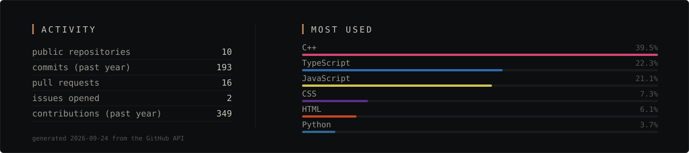
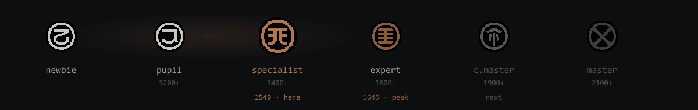

Backend engineer and competitive programmer in Pune. I build APIs, real-time
infrastructure and the data layers underneath, and I care most about how a system
behaves a year after it ships — which is usually decided in the first week.

Right now: **WChess** and **CP Insight**, plus a software engineering internship
at **ConstroIQ**.

### Stack

### Building

<table>
<tr>
<td width="104" align="center"></td>
<td>

**[WChess](https://github.com/AdiGo112/Wchess)** — real-time chess where the server is the only one telling the truth

The client is a renderer, not a referee. Clocks are one Redis sorted set of
deadlines swept every second, because a browser tab that lost focus can't be
trusted with time. Concurrent moves resolve by compare-and-set in Lua. A game row
and both rating updates land in one transaction or not at all.

`TypeScript` `NestJS` `PostgreSQL` `Redis` `Socket.io` `Stockfish WASM`

</td>
</tr>
<tr>
<td width="104" align="center"></td>
<td>

**[mini-tools](https://github.com/AdiGo112/mini-tools)** — the pieces, built from scratch to see how they work

A header-only Bloom filter, and a load balancer implementing seven strategies
side by side: round robin, weighted round robin, least connections, least
response time, consistent hashing, IP hash, power-of-two-choices.

`C++`

</td>
</tr>
<tr>
<td width="104" align="center"></td>
<td>

**[CP Insight](https://github.com/AdiGo112/CP_Insight)** — reality, not vanity

A Codeforces dashboard that reads the journey at the problem level instead of
counting submissions: which ratings actually break you, which tags you quietly
avoid, what a contest really cost.

`React` `Vite` `Node.js`

</td>
</tr>
<tr>
<td width="104" align="center"></td>
<td>

**[adityagorane.dev](https://adityagorane.vercel.app)** — portfolio as an engineering artifact

Case studies, a scroll-linked journey, a command palette, live stats served from
a public API. There is a door hidden in the footer.

`Next.js` `TypeScript` `Tailwind` `Framer Motion`

</td>
</tr>
</table>

<b>More in the repo list</b>

 

| | what it is | built with |
|---|---|---|
| **[BatchWise](https://github.com/AdiGo112/BatchWise)** | Campus discussion and placement platform. No backend — all state in Context, persisted to `localStorage`, with tests that render every route. | `React` `React Router` |
| **[QuickDual](https://github.com/AdiGo112/QuickDual)** | Two games at once: a bird through pipes on the keyboard while a ball stays alive on the mouse. Scores survival and accuracy. | `JavaScript` `Canvas` |
| **[Curricular](https://github.com/AdiGo112/Curricular)** | AI lab work written to be read: DFS/BFS, A\*, greedy shortest path, N-Queens by branch-and-bound and backtracking. | `Python` `C++` |
| **[EasyEMI](https://github.com/AdiGo112/EasyEMI)** | Loan EMI calculator and amortisation breakdown, server-rendered. A team build. | `Express` `EJS` |
| **[ChessWeb](https://github.com/AdiGo112/ChessWeb)** | Where WChess started — a browser board, before any of the hard parts had names. | `HTML` `JavaScript` |
| **[CP](https://github.com/AdiGo112/CP)** | Every Codeforces solution, kept as written during the contest. | `C++` |

### GitHub

### Competitive programming

456 problems across both platforms. Contests taught me abstraction, optimization
and debugging under pressure — most of what production asks for anyway. The first
three badges read live from the Codeforces API: no cron, no bot, no commit.

### Elsewhere

Rank glyphs and project markers are sprites from *Rain World* © Videocult /
Akupara Games, used as fan art and not endorsed by them.
